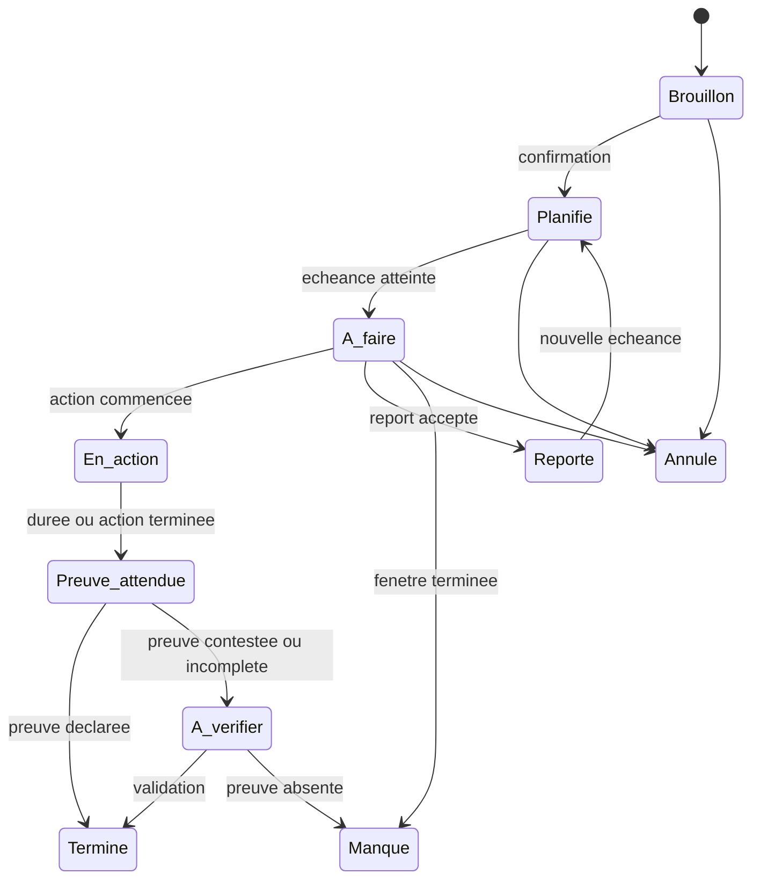

# Spécification du moteur d'intervention MVP

## Objectif

Le premier moteur doit répondre à une question limitée : pour un engagement concret, quel rappel envoyer, à quel moment et dans quel ton, tout en respectant les limites choisies par l'utilisateur ?

Le MVP utilise des règles locales et des modèles de messages versionnés. Il ne dépend pas d'un modèle de langage pour prendre une décision sensible ou produire une formulation imprévisible.

## Objets principaux

### Objectif

Un objectif décrit une direction durable, par exemple publier régulièrement ou reprendre une activité physique. Il donne du contexte, mais ne déclenche pas directement une notification.

### Engagement

Un engagement représente une action observable :

> Avant 21 h, publier un contenu original.

Il contient :

- une action ;
- une échéance ;
- une durée ou quantité facultative ;
- un type de preuve ;
- un statut ;
- un objectif parent.

### Politique d'intervention

Elle regroupe :

- le niveau maximal de ton ;
- les déclencheurs préférés ;
- les plages silencieuses ;
- le nombre maximal d'interventions quotidiennes ;
- les sujets interdits ;
- l'autorisation distincte du mode réveil.

### Observation

Une observation enregistre un fait minimal : message envoyé, action commencée, preuve déclarée, report, abandon, retour utilisateur ou dépassement de limite.

## Cycle de vie d'un engagement

La pause globale suspend les notifications sans modifier artificiellement le statut des engagements.

## Moments d'intervention

Le MVP distingue quatre moments :

1. **Confirmation** : reformuler l'engagement et la preuve attendue.
2. **Échéance** : rappeler l'action au moment choisi.
3. **Retard** : montrer factuellement le temps écoulé après l'échéance.
4. **Clôture** : demander une preuve, enregistrer un report ou constater un engagement manqué.

Une intervention avant l'échéance reste facultative et désactivée par défaut pour éviter la sur-sollicitation.

## Sélection d'un message

Le moteur applique les règles dans cet ordre :

1. vérifier la pause globale et la plage silencieuse ;
2. vérifier que l'engagement est encore actif ;
3. appliquer la limite quotidienne d'interventions ;
4. exclure les catégories et formulations interdites ;
5. identifier le moment de l'engagement ;
6. choisir un déclencheur encore testable ;
7. limiter le message à l'intensité consentie ;
8. remplir un modèle avec des faits vérifiables ;
9. enregistrer la décision et sa raison ;
10. proposer une réponse à faible effort.

Si une information manque, le moteur choisit une formulation neutre. Il n'invente jamais une cause, une émotion ou un trait de personnalité.

## Familles de messages

| Famille | Fonction | Exemple |
|---|---|---|
| Rappel neutre | Fournir une base de comparaison. | « Tu avais prévu 20 minutes sur ton projet maintenant. » |
| Écart factuel | Montrer la différence entre promesse et action. | « L'heure prévue est passée et aucune action n'est encore enregistrée. » |
| Défi court | Réduire le premier mouvement. | « Ouvre le projet et donne-moi cinq minutes réelles. » |
| Ironie | Créer une légère friction émotionnelle. | « Le planning avance très bien. Le projet, un peu moins. » |
| Demande de preuve | Fermer la boucle d'action. | « Qu'est-ce qui existe maintenant et qui n'existait pas avant de commencer ? » |

Les exemples servent de modèles éditoriaux. Ils ne doivent pas contenir de jugement global sur la valeur ou les capacités de l'utilisateur.

## Comparaison initiale

Le premier test contrôlable alterne entre :

- **A — rappel neutre** ;
- **B — confrontation factuelle**.

Les deux variantes conservent la même action, la même échéance et le même canal. La comparaison porte sur :

- action commencée ou non ;
- délai avant l'action ;
- action terminée ou non ;
- pression ressentie de 1 à 5 ;
- message utile, inutile, irritant ou trop loin.

Une seule personne et quelques observations ne suffisent pas à conclure à une efficacité générale. Le test sert à améliorer le prototype et le protocole.

## Réponses après intervention

Chaque notification ouvre cinq actions :

- **J'ai commencé** ;
- **C'est fait** ;
- **Dans 10 minutes** ;
- **Inutile** ;
- **Trop loin**.

« Trop loin » réduit immédiatement l'intensité autorisée pour l'objectif concerné et suspend la famille de message jusqu'à révision par l'utilisateur.

Les reports successifs restent des observations. Le moteur ne les transforme pas automatiquement en faute ou en dette.

## Règles de sécurité

- Aucun message pendant une plage silencieuse.
- Aucun mode nuit sans consentement distinct.
- Aucun dépassement de la fréquence maximale.
- Aucune formulation portant sur une vulnérabilité ou un sujet interdit.
- Aucun diagnostic ou déduction clinique.
- Aucun message généré à partir d'une information non confirmée.
- Pause globale accessible depuis la notification et l'écran principal.
- En cas de signal de détresse, arrêt du ton provocateur et orientation vers une aide appropriée.

## Événements minimaux

| Événement | Données nécessaires |
|---|---|
| `commitment_created` | identifiant local, échéance, type de preuve |
| `intervention_selected` | famille, intensité, raison de sélection |
| `intervention_delivered` | heure locale, canal |
| `action_started` | délai depuis l'intervention |
| `action_completed` | délai et preuve déclarée |
| `commitment_snoozed` | durée du report |
| `commitment_missed` | heure de clôture |
| `feedback_recorded` | utile, inutile, irritant ou trop loin |
| `policy_changed` | réglage modifié, sans conserver l'ancienne valeur sensible |

Tous les événements restent locaux dans le MVP. Une télémétrie distante future devra être volontaire, agrégée et désactivable.

## Critères d'acceptation

Le moteur MVP sera considéré fonctionnel s'il peut :

- planifier un engagement et une notification locale ;
- respecter les plages silencieuses et la fréquence maximale ;
- sélectionner un message avec une raison explicable ;
- alterner les variantes neutre et factuelle ;
- enregistrer le passage à l'action et la preuve déclarée ;
- appliquer immédiatement « Trop loin » ;
- fonctionner sans compte, connexion ou service d'IA distant ;
- exporter et supprimer toutes les données locales.

## Hors périmètre initial

- profil psychologique ;
- génération libre de messages par IA ;
- classement social ;
- surveillance automatique de l'activité du téléphone ;
- validation biométrique ou automatique des preuves ;
- mode partenaire ;
- synchronisation multi-appareils ;
- paiement et abonnement.
